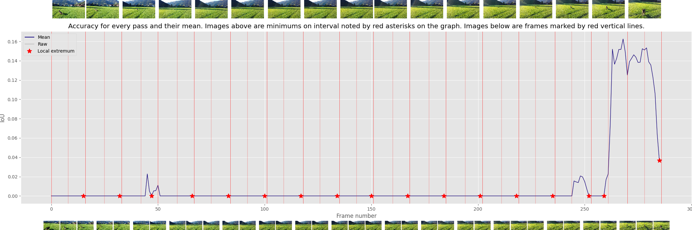
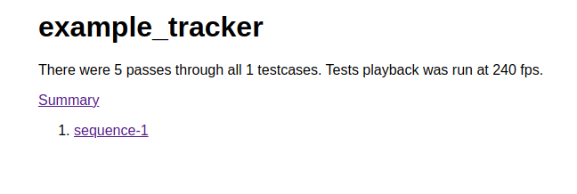
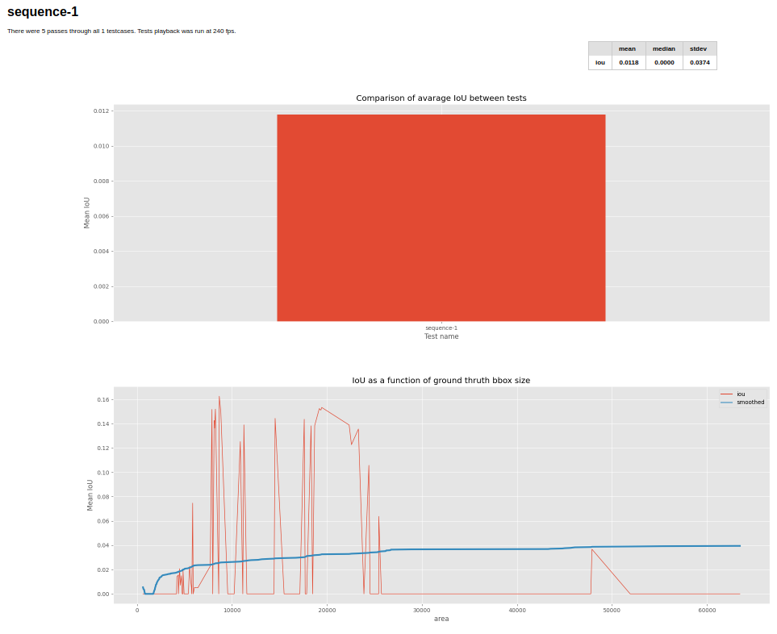
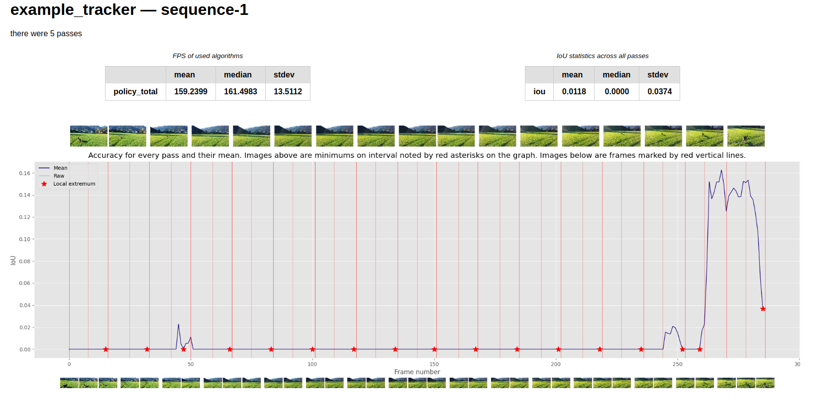
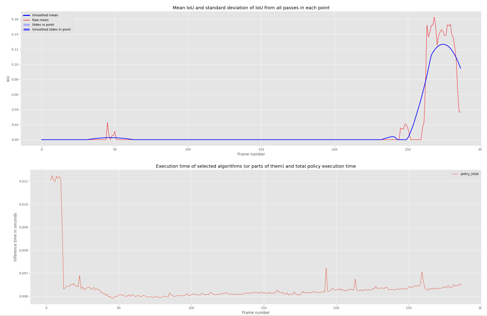

# Video Object Tracking report generator

Copyright (c) 2020-2021 [Antmicro](https://www.antmicro.com)

A python tool for generating reports regarding detection and tracking of a single object in video sequences.

*Check how this repository can be used in* [ros-tracking-policy-examples repository](https://github.com/antmicro/ros-tracking-nodes-policy-examples).

## Usage

To generate reports run `main.py` script. It takes exactly two positonal arguments: `output_path` and `input_path`, where:
* `output_path` is path to directory with test results; format of this repository is specified in the [ros-tracking-nodes-tester-node repository](https://github.com/antmicro/ros-tracking-nodes-tester-node).
* `input_path` path to directory containing dataset which was used to run the tests; the format is also described in the above-mentioned repository.

## Generated reports

Reports are generated as html files and `.png` images.

The `index.html` is the root of the report.
It contains a list of tested tracking policies.

For each policy, there is a summary and the performance per sequence.

The summary provide:

* Mean IoU for each video sequence.
* Plot describing the mean IoU depending on the size of the ground truth bounding box size.
* Mean, median and standard deviation for the IoU for all sequences.

The performance per sequence shows:

* Processed frames per second by the policy (mean, median, standard deviation),
* Mean, median and standard deviation for IoU metric,
* IoU changes over time for a given video sequence (this can tell which parts of the video sequence were especially tough for the policy),
* Inference time for each frame.

